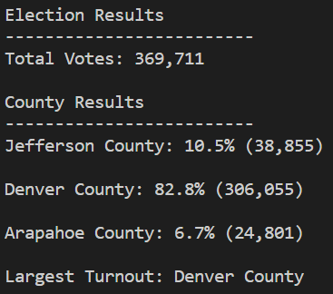
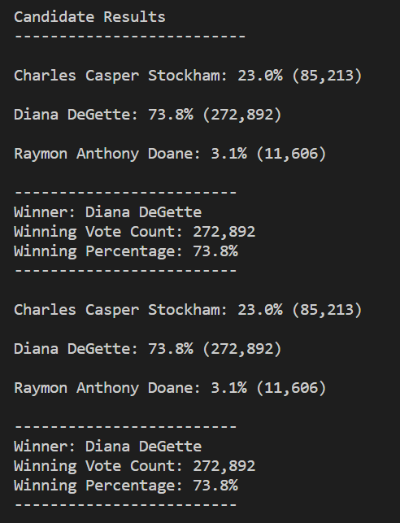

# Election Analysis

## Overview

Colorado elections officials are seeking a more efficient way to audit elections. Traditionally this has been done with a spreadsheet, but this is a time consuming method. The alternative approach is to automate the audit analysis by writing a program to perform it. The officials have asked that a program capable of assisting with election auditing be created and tested with data from a congressional election.

The program must complete several tasks:

1. Read data from a ".csv" file containg a header row and three coulums: Ballot ID, Candidate Name, and County.
2. Determine the total number of votes cast in the election.
3. Determine the total number of votes and the percentage of the total vote for each candidate.
4. Determine the total number of votes and the percentage of the total vote for each county.
5. Determine the county with the largest voter turnout.
6. Determine the winner of the election.
7. Display these findings in a terminal window.
8. Create or open a text file to output the results.
9. Write the results to the text file.

The data set analysed was provided by the elections officials in the form of a csv file. The program was written in Python (3.7) and edited with Microsoft Visual Studio Code.

## Methods
The principal pattern used for extraction and analysis is the for loop.

The data was read from the csv file by importing the csv library. The os library was also imported to assist in both input and output path resolution.
    
    # Add a variable to load a file from a path.
    file_to_load = os.path.join("Resources", "election_results.csv")
    # Add a variable to save the file to a path.
    file_to_save = os.path.join("analysis", "election_analysis.txt")
    
The "reader" method was used to extract data after opening the file_to_load.

    reader = csv.reader(election_data)

With the data stored in, the header row was discarded by advancing to the next item in reader. A for loop was used to move through each row after the header row. This loop collected or tallied by iteration:

- Total number of votes
- Name of each candidate
- Votes corresponding to each candidate
- Name of each county
- Votes corresponding to each county

If statements were used to determind if a candidate or county name was unique:

    if county not in county_name:

            # Append to list of names
            county_name.append(county)
            
            # Initialize vote count for current county
            county_votes[county] = 0

In the above case comparing the county in the current row of reader to those alraedy contained in the county_name list.

Dictionaries associating the name of a county or candidate with a count of votes were used to store this information for later calculations.

Two seperate for loops were used to conduct calculations and output for counties and candidates. The loops iterated over the dictionaries relating county or candidate names to votes using the current name to get the associated vote count to find the percentage of the total vote and display the number of votes.

    for county in county_votes:

        # Get votes for current county

        votes_cast = county_votes[county]

        # Calculate % of total votes cast in current county

        votes_cast_percent = (float(votes_cast)/float(total_votes))*100

         # Print the county results to the terminal.
        county_out = f"{county} County: {votes_cast_percent:.1f}% ({votes_cast:,})\n"
        
        print(county_out)

        # Save the county votes to a text file.

        txt_file.write(county_out)

         # Determine highest turnout

        if votes_cast > county_high_turnout_votes:

            county_high_turnout_votes = votes_cast
            county_high_turnout = county

Output to both terminal and the text file also occured during these for loops as the values were calculated.

The if statement above was used to determine the county with the most votes. A similar statement was used to determine the winner of the election. It compares the vote count for the current county to the highest encountered so far (initialized at 0). If the count is higher, the highest number of votes and the name of the county are replaced with values for the current county.

Below is the terminal output of the program:

## Results
The analysis of the election data produced the following:

- 369,711 total votes were cast
- 3 candidates ran in this election:
  - Charles Casper Stockham: 23.0% of the vote with 85,213 votes.
  - Diana DeGette: 73.8% of the vote 272,892 votes.
  - Raymon Anthony Doane: 3.1% of the vote with 11,606 votes.
- 3 counties were represented:
  - Jefferson County: Making up 10.5% with 38,855 votes.
  - Denver County: Making up 82.8% with 306,055 votes.
  - Arapahoe County: Making up 6.7% with 24,801 votes.
- Denver County had the highest number of votes.
- Diana DeGette was the winner of the election with 272,892 votes representing 73.8% of the vote.

## Summary

This program fufills the design parameters and is well suited to an election audit of this type. It could, with some modification, be generalized to be useful in different types of elections or if different data is required. 

If a breakdown of how each county voted is desired, a new dictionary relating candidate : votes in xyz county can be created for each county. In the initial for loop data extraction, an if statement can be used to determine if the county in the current row is xyz and add 1 to the vote count for the current candidate.

For statewide office, the same structure can be used if the same output is desired. Similarly, for the popular vote in a presidential election the label of counties could be replaced with States. Some modification may be required to formatting the output.

The code can be modified to accomodate ranked choice voting. For this example the goal is to report the winner of the race and the officially tallied votes for each candidate, that is, votes for eliminated candidates will stop being counted. Assuming N choices and data of the form (voter ID, Choice 1, Choice 2, ..., Choice N, County). A new list containing the names of eliminated candidates should be created. The code can be modifed so that after data is collected for the number of time each candidate is chosen first, using the existing for loop, an if statement can be added to decide if candidate has a majority. If so, the program may continue as written. If not, an the candidate with the fewest votes must be added to the list of eliminated candidates and the Choice 2 column must be tallied except for the eliminated candidate. This could be accomplished in multiple ways. Below is the current for loop with one possible method of modification.

    # NOTE: County related code deleted for this example.

    # Create Eliminated list
    eliminated = []

    # Winner detected
    win = false

    most = 0
    least = 0
    lead = ""
    last = ""

    # Index
    ind = 1
    # N assumed to be known

    while ind < N:
    # For each row in the CSV file.
        for row in reader:
        
            # Add to the total vote count
            total_votes = total_votes + 1

            # Get the candidate name from each row.
                candidate_name = row[ind]

            # If the candidate does not match any existing candidate add it to
            # the candidate list
            if candidate_name not in candidate_options:

                # Add the candidate name to the candidate list.
                candidate_options.append(candidate_name)

                # And begin tracking that candidate's voter count.
                candidate_votes[candidate_name] = 0

            # Add a vote to that candidate's count
            if candidate_name not in eliminated:
                candidate_votes[candidate_name] += 1
        for candidate_name in candidate_votes:
            # Determine leader and candidate to eliminate
            if candidate_votes[candidate_name] > most:
                most = candidate_votes[candidate_name]
                lead = candidate_name
            if candidate_votes[candidate_name] < least:
                least = candidate_votes[candidate_name]
                last = candidate_name
        eliminated.append(last)
        ind += ind

